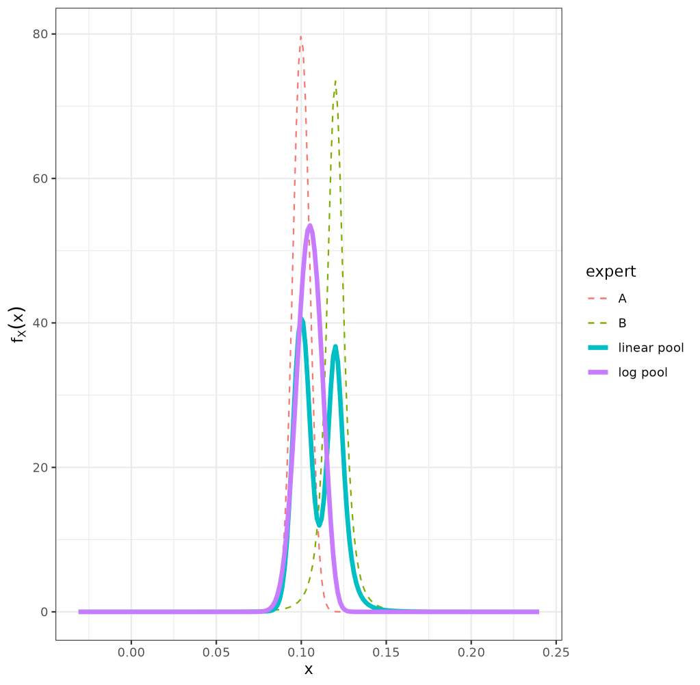
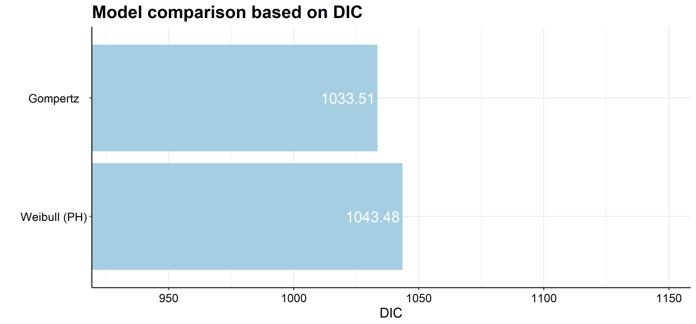
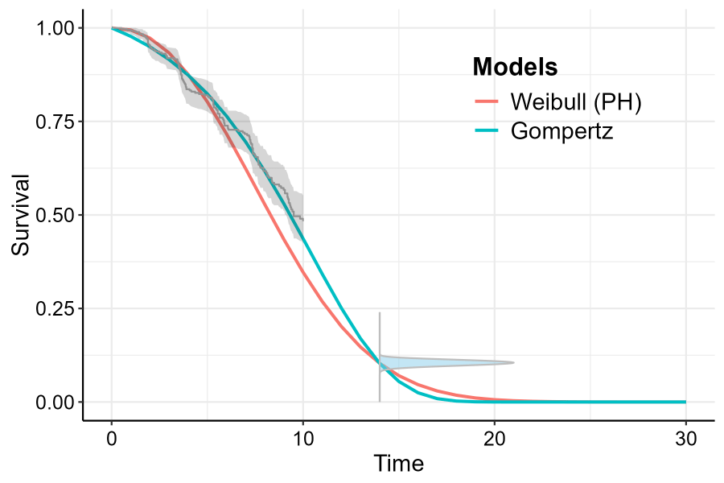
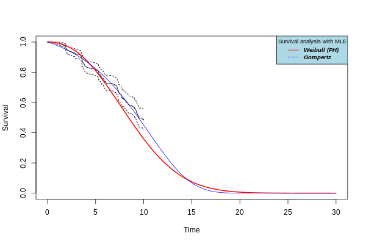
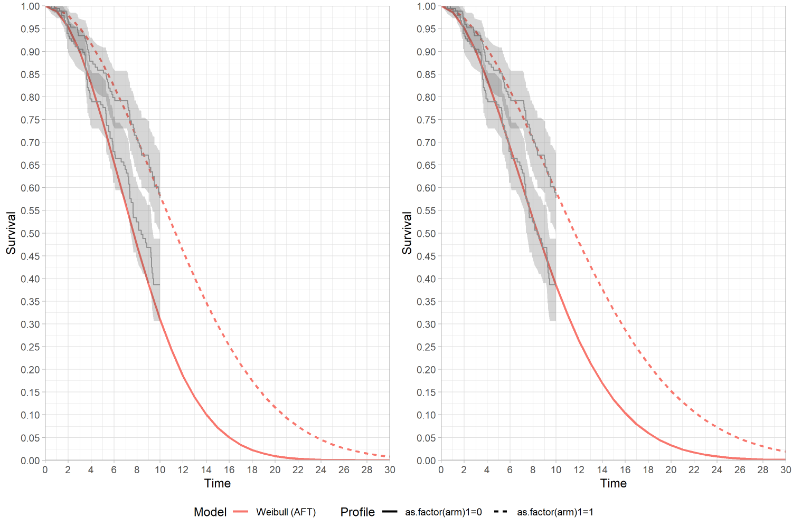
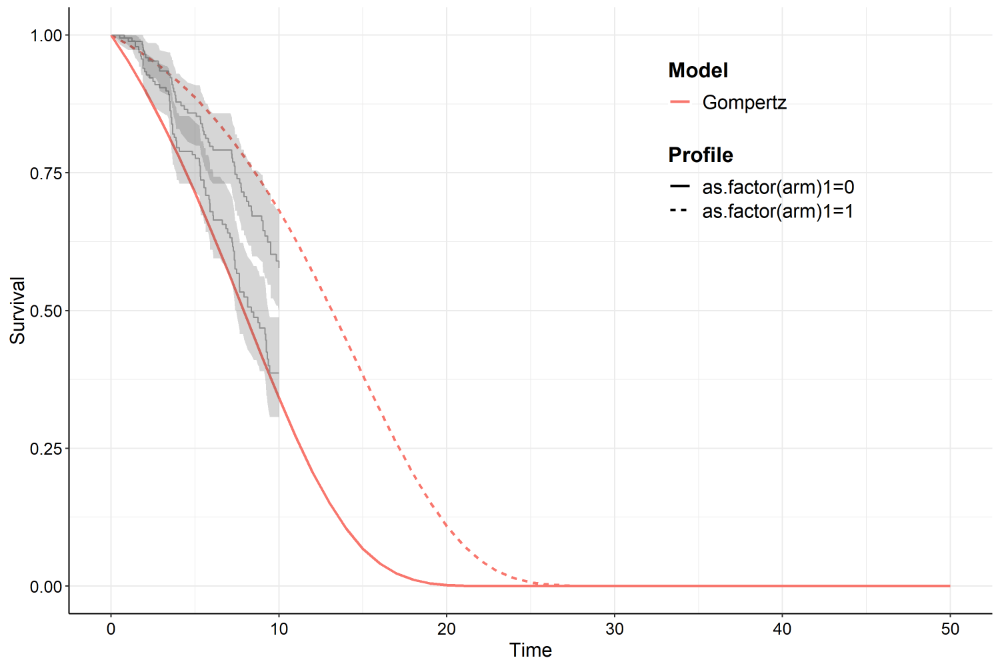
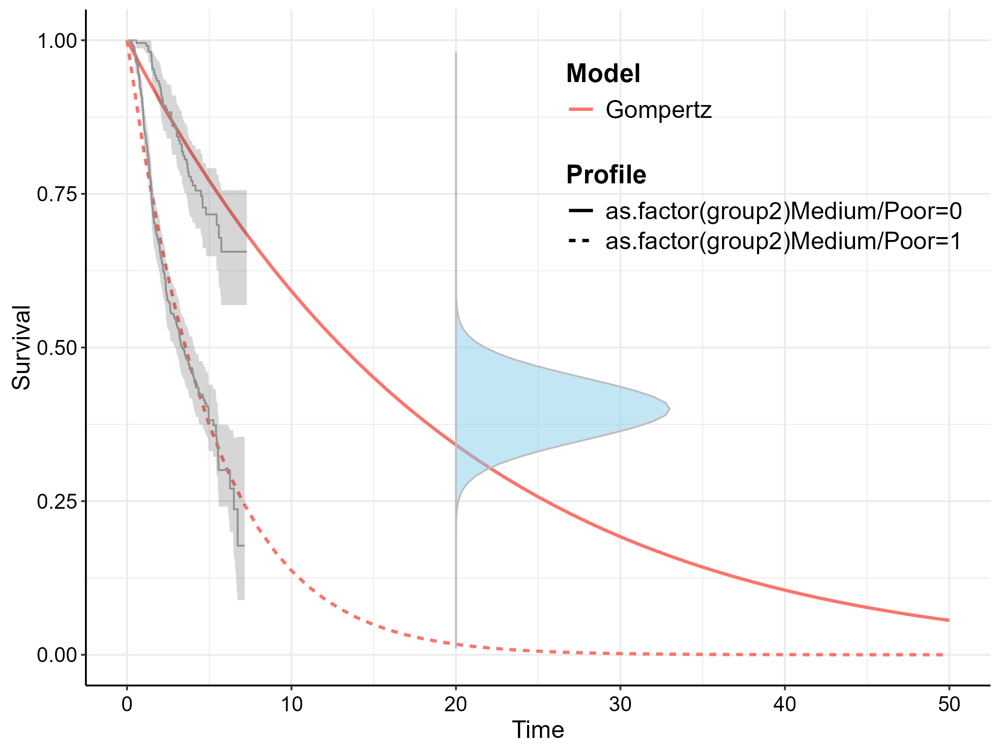
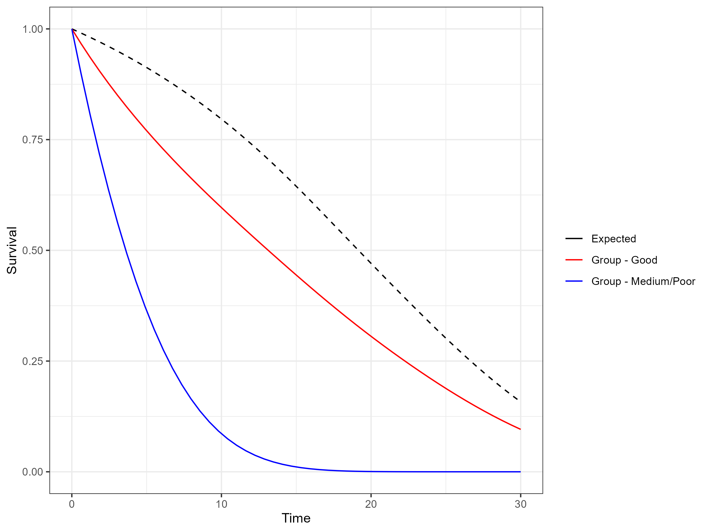
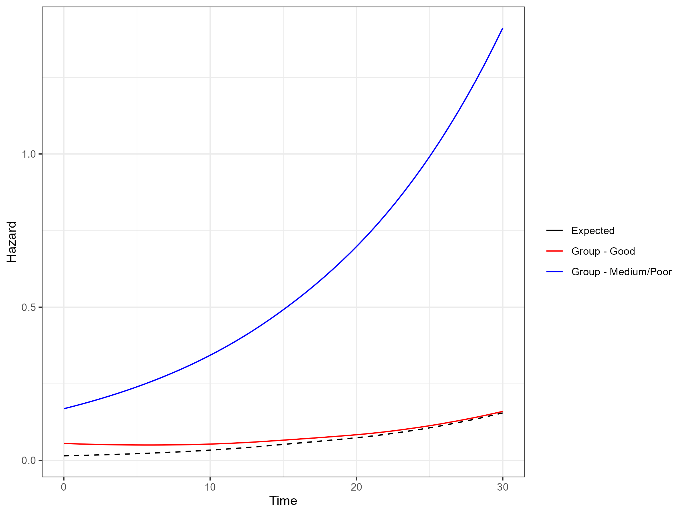

<!-- README.md is generated from README.Rmd. Please edit that file -->

#  expertsurv

<br clear="all"/> <!-- badges: start --> <!-- badges: end -->

The goal of `expertsurv` is to incorporate expert opinion into an
analysis of time to event data. `expertsurv` uses many of the core
functions of the `survHE` package (Baio 2020) and also the `flexsurv`
package (Jackson 2016). Technical details of the implementation are
detailed in (Cooney and White 2023) and will not be repeated here.

The key function is `fit.models.expert` and operates almost identically
to the `fit.models` function of `survHE`.

## Installation

You can install the released version of expertsurv from
[CRAN](https://CRAN.R-project.org/package=expertsurv) with:

``` r
install("expertsurv")
```

## Expert Opinion on Survival at timepoints

If we have elicited expert opinion of the survival probability at
certain timepoint(s) and assigned distributions to these beliefs, we
encode that information as follows:

``` r
#A param_expert object; which is a list of 
#length equal to the number of timepoints
param_expert_example1 <- list()

#If we have 1 timepoint and 2 experts
#dist is the names of the distributions
#wi is the weight assigned to each expert (usually 1)
#param1, param2, param3 are the parameters of the distribution
#e.g. for norm, param1 = mean, param2 = sd
#param3 is only used for the t-distribution and is the degress of freedom.
#We allow the following distributions:
#c("normal","t","gamma","lognormal","beta") 


param_expert_example1[[1]] <- data.frame(dist = c("norm","t"),
                                         wi = c(0.5,0.5), # Ensure Weights sum to 1
                                         param1 = c(0.1,0.12),
                                         param2 = c(0.005,0.005),
                                         param3 = c(NA,3))
param_expert_example1
#> [[1]]
#>   dist  wi param1 param2 param3
#> 1 norm 0.5   0.10  0.005     NA
#> 2    t 0.5   0.12  0.005      3

#Naturally we will specify the timepoint for which these probabilities where elicited

timepoint_expert <- 14


#In case we wanted a second timepoint -- Just for illustration

# param_expert_example1[[2]] <- data.frame(dist = c("norm","norm"),
#                                          wi = c(1,1),
#                                          param1 = c(0.05,0.045),
#                                          param2 = c(0.005,0.005),
#                                          param3 = c(NA,NA))
# 
# timepoint_expert <- c(timepoint_expert,18)
```

If we wanted opinions at multiple timepoints we just include append
another list (i.e. param_expert_example1\[\[2\]\] with the relevant
parameters) and specify `timepoint_expert` as a vector of length 2 with
the second element being the second timepoint.

For details on assigning distributions to elicited probabilities and
quantiles see the `SHELF` package (Oakley 2021) and for an overview on
methodological approaches to eliciting expert opinion see (O’Hagan
2019). We can see both the individual and pooled distributions using the
following code (note that we could have used the output of the `fitdist`
function from `SHELF` if we actually elicited quantiles from an expert):

    plot_opinion1 <- plot_expert_opinion(param_expert_example1[[1]], 
                        weights = param_expert_example1[[1]]$wi)
    ggsave("Vignette_Example 1 - Expert Opinion.png")

For the log pool we have a uni-modal distribution (in contrast to the
bi-modal linear pool) which has a $95\%$ credible interval between
$9.0−11.9\%$ calculated with the function below:

    cred_int_val <- cred_int(plot_opinion1,val = "log pool", interval = c(0.025, 0.975))

<div class="figure" style="text-align: center">


<p class="caption">
Expert prior distributions
</p>

</div>

We load and fit the data as follows (in this example considering just
the Weibull and Gompertz models), with `pool_type = "log pool"`
specifying that we want to use the logarithmic pooling (rather than
default “linear pool”). We do this as we wish to compare the results to
the penalized maximum likelihood estimates in the next section. The stan
models are not compiled at installation, in fact, they are accessed as
saved objects from the `inst` folder. Therefore, it is much quicker to
include the extra argument `compile_mods = compiled_models_saved` than
requiring stan to recompile the model at each evaluation.

Because of CRAN’s package size limitations (\< 5Mb) it is not possible
to include this in the data folder, therefore, this should be compiled
when the package is first installed.

    # After installation
     compiled_models_saved <- expertsurv:::compile_stan()
     path_all <- system.file("data",package = "expertsurv")
     save(compiled_models_saved, file = paste0(path_all,"/compiled_stan.RData"), compress = "xz")

    # At start of session
    load(paste0(paste0(path_all,"/compiled_stan.RData")))


    data2 <- data %>% rename(status = censored) %>% mutate(time2 = ifelse(time > 10, 10, time),
                                                                  status2 = ifelse(time> 10, 0, status))

    #Set the opinion type to "survival"

    example1  <- fit.models.expert(formula=Surv(time2,status2)~1,data=data2,
                                   distr=c("wph", "gomp"),
                                   method="bayes",
                                   iter = 5000,
                                   pool_type = "log pool", 
                                   opinion_type = "survival",
                                   times_expert = timepoint_expert, 
                                   param_expert = param_expert_example1,
                                   compile_mods = compiled_models_saved)

Both visual fit and model fit statistics highlight that the Weibull
model is a poor fit to both the expert opinion and data (black line
referring to the $95\%$ confidence region for the experts prior belief).

The below code provides the goodness of fit (in this case DIC, however,
I prefer WAIC or PML). Also presented is the survival plots, at the
posterior mean values. If opinion was included on survival outcomes it
can be helpful to visualize the density of the expert opinion by
`plot_opinion = TRUE`. Statistical uncertainty can also be plotted using
the `plot_ci = TRUE` argument and by specifying `nsim` equal to however
many simulations you desire (for Bayesian models this must be less than
the total number of simulations from the posterior). By default the
confidence/credible intervals are plotted as dashed lines, however, if
an area/ribbon plot is preferred then set `ci_plot_ribbon = TRUE`.

Even if statistical uncertainty is not required in the plots, I
recommend `nsim` is set to a reasonable number. If `nsim = 1` as by
default, the maximum likelihood estimates or the posterior mean of the
parameters will be used to plot the results. In most cases this should
suffice (particularly for maximum likelihood), however, the expected
survival estimated by the full sampling distribution may be different to
the estimate at it’s expectation/max likelihood estimate. This more
likely in the Bayesian analysis if the posterior is non-normal. In the
below plot the results for both approaches are similar and therefore, we
omit these arguments.

    model.fit.plot(example1, type = "dic") #Also "waic" or "pml"
    plot(example1, add.km = T, t = 0:30,plot_opinion  = TRUE)

<div class="figure" style="text-align: center">


<p class="caption">
Model Comparison
</p>

</div>

<div class="figure" style="text-align: center">


<p class="caption">
Survival function with Expert prior
</p>

</div>

## Expert Opinion using Penalized Maximum Likelihood

We can also fit the model by Penalized Maximum Likelihood approaches
based on code taken from the `flexsurv` package (Jackson 2016). All that
is required that the `method="bayes"` is changed to `method="mle"` with
the `iter` argument now redundant. One argument that maybe of interest
is the `method_mle` which is the optimization procedure that `flexsurv`
uses. In case the optimization fails, we can sometimes obtain
convergence with the `Nelder-Mead` algorithm. If the procedure is still
failing, it may relate to the expert opinion being too informative.

It should be noted that the results will be similar to the Bayesian
approach when the expert opinion is unimodal and relatively more
informative, therefore we use the logarithmic pool which is unimodal.

We find that the AIC values also favour the Gompertz model by a large
factor (not shown) and are very similar to the DIC presented for the
Bayesian model.

<!-- ```{r echo = FALSE, fig.cap = "Survival function with Expert Information-Penalized Maximum Likelihood"} -->
<!--  -->
<!-- ``` -->
<!--$\texttt{expertsurv}$ modifies some of the $\texttt{flexsurv}$ functions, so if you wish to use revert to the original $\texttt{flexsurv}$ functions within the same session you should run the following commands:
&#10;```
    unloadNamespace("flexsurv") #Unload flexsurv and associated name spaces
    require("flexsurv") #reload flexsurv
```-->

## Expert Opinion on Survival of a comparator arm

In this situation we place an opinion on the comparator arm. In this
example `id_St` is used to specify the row number in the data frame of
the comparator arm, indicating that the covariate pattern for this row
represents the group for which the expert opinion is provided.

    param_expert_example2[[1]] <- data.frame(dist = c("norm"),
                                             wi = c(1),
                                             param1 = c(0.1),
                                             param2 = c(0.005),
                                             param3 = c(NA))

    #Check the coding of the arm variable
    #Comparator is 0, which is our id_St
    unique(data$arm)
    [1] 0 1

    #We want our opinion to refer to the treatment called "0" 
    example2  <- fit.models.expert(formula=Surv(time2,status2)~as.factor(arm),
                                            data=data2,
                                            distr=c("wei"),
                                            method="bayes",
                                            iter = 5000,
                                            opinion_type = "survival",
                                            id_St = min(which(data2$arm ==0)), 
                                            times_expert = timepoint_expert, 
                                            param_expert = param_expert_example2)

We can remove the impact of expert opinion omitting the arguments
relating to `opinion_type,id_St,times_expert,param_expert`, $\dots$ with
the function.

<div class="figure" style="text-align: center">


<p class="caption">
Survival function with Expert prior (left) and Vague prior (right)
</p>

</div>

The survival function for “arm 1” has been shifted downwards slightly,
however the covariate for the accelerated time factor has markedly
increased to counteract the lower survival probability for the reference
(arm 0).

## Expert Opinion on Survival Difference

This example illustrates an opinion on the survival difference. For
illustration we use the Gompertz, noting that a negative shape parameter
will lead to a proportion of subjects living forever. Clearly the mean
is not defined in these cases so the code automatically constrains the
shape to be positive. It should also be noted that there are many
potential combinations of survival curves which could produce a
difference in the expected survival of 5 months. If this approach is
considered, the number of iterations should be quite large to ensure
convergence.

    param_expert3 <- list()

    #Prior belief of 5 "months" difference in expected survival
    param_expert3[[1]] <- data.frame(dist = "norm", wi = 1, param1 = 5, param2 = 0.2, param3 = NA)


    survHE.data.model  <- fit.models.expert(formula=Surv(time2,status2)~as.factor(arm),data=data2,
                                                         distr=c("gom"),
                                                         method="bayes",
                                                         iter = 5000,
                                                         opinion_type = "mean",
                                                         id_trt = min(which(data2$arm ==1)), # Survival difference is  Mean_surv[id_trt]- Mean_surv[id_comp] 
                                                         id_comp = min(which(data2$arm ==0)),
                                                         param_expert = param_expert3)
                                                         
                                                         

<div class="figure" style="text-align: center">


<p class="caption">
Survival difference
</p>

</div>

## Compatability with underlying packages survHE and flexsurv

As stated in the introduction this package relies on many of the core
functions of the `survHE, flexsurv` packages (Baio 2020) and (Jackson
2016). Because future versions of `survHE` and `flexsurv` may introduce
conflicts with the current implementation, we have directly ported the
key functions from these packages into the package so that `expertsurv`
no longer imports `survHE,flexsurv` (of course all credit for those
functions goes to Jackson (2016)).

If you run in issues, bugs or just features which you feel would be
useful, please let me know (<phcooney@tcd.ie>) and I will investigate
and update as required.

<!-- One practical difference between the packages is the calculation of DIC (Deviance Information Criterion). In  $\texttt{survHE}$ the posterior median is used as the plug-in estimate for the log-likelihood, while we use the posterior mean as per the definition of DIC by [@Spiegelhalter.2003], noting that both estimates should be very similar.  -->
<!-- ## Survival curves implied by Expert Opinion alone -->
<!-- In some situations it may be of interest to see the range of predicted survival functions given the expert opinion. The easiest solution is to simulate two or more observations. In order to remove the effect of these data points we supply the following argument to the `fit.models.expert` function which essentially sets the likelihood contribution to zero for these points: -->
<!-- ``` -->
<!-- a0 = rep(0.001,nrow(df1)) -->
<!-- ``` -->
<!-- Using Stan and JAGS to simulate these "posteriors" is inefficient and because of lack of identifiability (due to having no data), Markov Chain Monte Carlo diagnostics will suggest there is a problem. A more efficient approach for the Weibull distribution is sketched out below and (similar to [@Ouwens.2018]) would be to: -->
<!--  - Simulate times from the Survival distribution  -->
<!--  - Simulate values of the shape from a vague distribution -->
<!--  - Reexpress the scale in terms of the shape  -->
<!--  As we can see the 90% credible intervals are very wide, narrowing only at the timepoint at which there is expert opinion. -->
<!-- ``` -->
<!-- nsims <- 10000 -->
<!-- Surv_samp <- rbeta(nsims, 10, 100) -->
<!-- ancs <- runif(nsims, 0, 10) #shape -->
<!-- time_expert <- 14 -->
<!-- loc <- exp((ancs*log(time_expert)-log(-log(Surv_samp)))/ancs) -->
<!-- time <- c(0:20) -->
<!-- res <- cbind(ancs,loc) -->
<!-- St <- apply(res, 1, function(x){pweibull(time,x[1],x[2], lower.tail = F )}) -->
<!-- St_sum <- apply(St, 1, quantile, probs = c(0.1, 0.9), na.rm = T) -->
<!-- plot(y = St_sum[1,], x = time, type= "l", xlab = "Time", ylab = "St", -->
<!-- main = "90% interval for survival with St from Beta(10,100)") -->
<!-- lines(y = St_sum[2,], x = time ) -->
<!-- ``` -->
<!-- ```{r echo = FALSE, fig.cap = "Predicted survival without data"} -->
<!-- knitr::include_graphics("Survival without Data.png") -->
<!-- ``` -->

## Model Diagnostics

As this is a Bayesian analysis convergence diagnostics should be
performed. Poor convergence can be observed for many reasons, however,
because of our use of expert opinion it may be a symptom of conflict
between the observed data and the expert’s opinion.

Default priors should work in most situations, but still need to be
considered. At a minimum the Bayesian results without expert opinion
should be compared against the maximum likelihood estimates. If
considerable differences are present the prior distributions should be
investigated.

Because the analysis is done in JAGS and Stan we can leverage the
`ggmcmc` package (Fernández-i-Marín 2016):

    library(ggmcmc)
    #For Stan Models # Log-Normal, RP, Exponential, Weibull
    ggmcmc(ggs(rstan::As.mcmc.list(example1$models$`Exponential`)), file = "Exponential.pdf")

    #For JAGS Models # Gamma, Gompertz, Generalized Gamma
    ggmcmc(ggs(as.mcmc(example1$models$`Gamma`)), file = "Gamma.pdf")

## General Population Mortality

*Please note that this functionality is still in an experimental stage*

Because `expertsurv` uses `flexsurv` functions internally the models fit
by penalized maximum likelihood `method = "mle"` inherit the
`flexsurvreg` class. This means that we can leverage advanced approaches
such as the inclusion of general population mortality. This is discussed
in more detail in the package documentation of the `flexsurv` package
and more specifically the `standsurv` vignette (Sweeting 2023), however,
the key point to note is that the parameter estimates obtained from the
survival models are for the *relative* survival model and therefore are
not representative of the all-cause survival (which typically considers
the disease specific and general population mortality hazards).

After making the modifications to the `bc` dataset as in the `standsurv`
vignette, we assume a the expert believes that the expected survival for
the “Good” group is $40\%$ with a standard deviation of $5\%$ and can be
characterized by a Normal distribution at 20 years.

We fit a Gompertz distribution and note the survival below.


    timepoint_expert <- 20

    example1  <- fit.models.expert(formula=Surv(recyrs,censrec)~as.factor(group2),data=bc,
                                   distr=c("gomp"),
                                   method="mle",
                                   opinion_type = "survival",
                                   times_expert = timepoint_expert, 
                                   param_expert = param_expert_example1,
                                   id_St = min(which(bc$group2 =="Good")))

<div class="figure" style="text-align: center">


<p class="caption">
Survival Estimates without General Population Mortality
</p>

</div>

We have not, however, considered the impact of general population
mortality, and in this example the expected survival of the general
population is approximately $50\%$. Therefore, the expert’s belief that
the expected survival of the “Good” group is $40\%$ implies that the
hazard of the this group approaches that of the general population. To
include this, we first need to extract the parameters of the expert
opinion that were used in the previous model (I don’t currently have a
function to do this without running the `fit.models.expert` first).

The survival of the general population at the elicited timepoint is
added to the `expert_opinion_flex` list and supplied to the exposed
`expertsurv:::flexsurvreg` function (this is the `flexsurvreg` function
which is only available internally to the `expertsurv` package and so
does not conflict with `flexsurv::flexsurvreg`). Furthermore, we no
longer assume proportional hazards so that we can illustrate the hazards
of the “Good” group.

    expert_opinion_flex <- example1$misc$flex_expert_opinion[[1]]
    expert_opinion_flex$bhazard_par <- c(0.5)

    model.gomp.sep.rs <- expertsurv:::flexsurvreg(Surv(recyrs, censrec)~as.factor(group2),  
                                         data=bc, dist="gompertz",
                                         anc = list(shape = ~ as.factor(group2)),
                                         bhazard=exprate,expert_opinion = expert_opinion_flex)

Using the `standsurv` functions (as documented by (Sweeting 2023)) we
can generate the all-cause hazards and survival. While the all cause
survival is broadly similar to the predicted survival for the “Good”
group without general population mortality adjustment at the timepoint
of 20 years, the adjustment ensures that the “Good” group survival does
not exceed the general population mortality which would be the case at a
timepoint of 30 years.

Although theoretically possible, the general population mortality
adjustment has not been implemented for the situation when expert
opinion is provided for differences in mean survival.

<div class="figure" style="text-align: center">


<p class="caption">
All-cause Survival Estimates including General Population Mortality
</p>

</div>

<div class="figure" style="text-align: center">


<p class="caption">
All-cause Hazard Functions including General Population Mortality
</p>

</div>

## Setting Initial values to estimate models (Particularly Gompertz)

In most cases, the models are estimated successfully. However, there are
instances where the choice of initial values is crucial. This is
especially significant for the Gompertz model when using Bayesian
methods. The Gompertz model is fit using the *zero’s* trick (since it is
not available as a probability distribution in JAGS). To mitigate these
issues, `expertsurv` fits the Gompertz model using penalized maximum
likelihood and then uses these penalized maximum likelihood estimates as
initial values for the Bayesian approach.

If this approach also fails, user-defined initial values can be provided
as shown below.

    #alpha is the same as the shape parameter in the flexsurv Gompertz model
    #beta is the same as the log(rate) parameter flexsurv Gompertz model.
    #beta can also include the log(HR) for any covariates
    alpha <- 1
    beta <- 1

    #beta needs to be a vector of length equal to H
    #H is 2 whether or not one covariate has been included, however,
    #if more than one covariate is included it is the number of covariates +1.
    #It can also be accessed from a successfully fit Bayesian model.
    #example1_bayes[["misc"]][["data.stan"]][[1]]["H"]

    H <- 2
    if(data.jags$H > length(beta)){
      beta <- c(beta, rep(0,H-length(beta)))
    }
          
    modelinits <- function(){
      list(alpha1 = alpha1,alpha2 = alpha2, beta = beta) 
    }
    #Finally create a function supplying these initial values and then supply 
    #them as a list with the name of the sublist being the model (i.e. gom)

    example1_bayes  <- fit.models.expert(formula=Surv(time2,status2)~1,data=data2,
                                         distr=c("wei", "gom", "lno","llo","gam","wph","exp", "rps"),
                                         method="bayes",
                                         opinion_type = "survival",
                                         times_expert = timepoint_expert, 
                                         param_expert = param_expert_example1,
                                         iter = 10000, 
                                         k = 1,
                                         knots = c(-1,0,0.5),
                                         a0 = rep(0.0001, 3),
                                         init = list(gom = modelinits),
                                         compile_mods = compiled_models_saved,
                                         expert_only = F)

Supplying initial values for models fit by penalized maximum likelihood
is straightforward. By default, initial values for the model with expert
opinion are taken from a model fit without data (this happens
internally). However, there may be situations where the user wants to
supply their own initial values.

For example, if you wish to include expert opinion that is both strong
(i.e., the distribution represents the belief with low variance) and
significantly different from the survival generated based on data alone,
setting the initial values to be equal to the maximum likelihood
estimates may result in optimization failure.

In such cases, it may make sense to first fit the model to the data with
an expert opinion having the same expected value (i.e., mean of the
distribution representing their belief) but a larger variance. The
values obtained from this model could then be used as initial values for
the model with the stronger expert opinion. Note that setting initial
values (`inits`) is not implemented for the spline-based models.

    require("dplyr")
    #Expert Opinion as a normal distribution centered on 0.1 with sd 0.005
    param_expert_example1 <- list()
    param_expert_example1[[1]] <- data.frame(dist = c("norm"),
                                             wi = c(1), # Ensure Weights sum to 1
                                             param1 = c(0.1),
                                             param2 = c(0.01),
                                            param3 = c(NA))
    timepoint_expert <- 14 # Expert opinion at t = 14

    data2 <- data %>% rename(status = censored) %>% mutate(time2 = ifelse(time > 10, 10, time),
    status2 = ifelse(time> 10, 0, status))

    #Set the expert opinion to be less strong... i.e. greater variance
    param_expert_example1_vague <- param_expert_example1
    param_expert_example1_vague[[1]][,4] <- 0.1

    example1_vague  <- fit.models.expert(formula=Surv(time2,status2)~1,data=data2,
                                  distr=c("wei", "gom"),
                                  method="mle",
                                  opinion_type = "survival",
                                  times_expert = timepoint_expert, 
                                  param_expert = param_expert_example1_vague)
                                  

    example1  <- fit.models.expert(formula=Surv(time2,status2)~1,data=data2,
                                   distr=c("gom","wei"),
                                   method="mle",
                                   opinion_type = "survival",
                                   times_expert = timepoint_expert, 
                                   param_expert = param_expert_example1,
                                   init = list(gomp = example1_vague$models$Gompertz$res[,1],
                                               wei = example1_vague$models$`Weibull (AFT)`$res[,1]))
                                

## Technical note on the impact of priors

The approach of (Cooney and White 2023) integrates the expert opinion by
considering inclusion of the expert opinion in terms of a loss function,
however, the information could also be formulated as a valid prior
distribution.

Consider an expert who has a belief that expected survival of a
population at 10 years ($t^*$) is normally distributed with a mean of
0.1 ($\mu_{expert}$) and standard deviation of 0.05 $\sigma_{expert}$.
To implement this as a prior density we treat the parameters of the
expert’s opinion as hyperpriors.

The density of this prior is specific to the survival model that we are
estimating and we will first consider the exponential model with
parameter $\theta$ and survival at the expert’s elicited time of
$S(t^*) = \exp\{{-\theta t^*\}}$. Setting the density of the prior to be
$\pi(\theta|\mu_{expert},\sigma_{expert}) \propto \exp\left\{ -\frac{1}{2}\left(\frac{\exp(-\theta t^*) - \mu_i}{\sigma_i}\right)^2 \right\}$.
This prior provides the the same density as including the information as
a loss function and setting the prior on $\theta$ to uniform over the
support of $\theta$ (i.e. $[0,\infty)$).

It is important to recognize that a uniform density on a parameter will
not imply a uniform density on a transformation of that parameter. For
the one parameter model this is straightforward to calculate via the
change of variables technique. Defining $g(\theta)$ as the survival
function of the exponential model, the inverse function of $g(\theta)$
is $g^{-1}(\theta) = \frac{-\log(S(t))}{t^*}$, we see that the density
of $S(t^*)$ implied by a uniform prior is $|g^{-1}(\theta)|$ which is
clearly non-uniform (with $|x|$ denoting the absolute value of $x$). For
the model with the expert opinion as a normal distribution we can use
the change-of-variables technique but in the opposite direction,
i.e. given a normal density of the survival what is associated density
for the parameter ($\theta$). We see that the density of this function
is
$\exp\left\{ -\frac{1}{2}\left(\frac{\exp(-\theta t^*) - \mu_i}{\sigma_i}\right)^2 \right\}|g'(\theta)|$
where $g'(\theta)$ is the derivative of the survival function with
respect to $\theta$.

In the case of a multiparameter model (e.g. Weibull), with parameter
vector $\mathbf{\theta_m}$ of dimension $m$, $g(\mathbf{\theta_m})$ will
not be invertible and obtaining a density for $p(\mathbf{\theta_m})$
will not be strictly possible. Interestingly for all survival models we
have considered we can obtain the required density for the expert’s
belief using a prior of the form
$p(\theta_m) \propto \exp \left\{ -\frac{1}{2}\left(\frac{S(t^*|\theta_m) - \mu_i}{\sigma_i}\right)^2 \right\}\sum_{i = 1}^m|g_{m}^{'}(\mathbf{\theta})|$
where $|g_{m}^{'}(\mathbf{\theta})|$ is the partial derivative of the
function $g(\mathbf{\theta})$ with respect to $\theta_m$. In some
situations it is only necessary to include one of the $m$ elements
$|g_{m}^{'}(\mathbf{\theta})|$ (typically the largest element). It is
important, however, to verify the prior density generates the
appropriate density at the particular survival. For example with the
log-logistic the density matched perfectly if the expert’s opinion was
near zero, however, if the opinion was near 0.5 the density had an
unusal bimodal shape.

This approach is not considered in the `expertsurv` package as the
impact of the prior (either uniform or vague), typically is very minor
(Cooney and White 2023).

# Potential Future Updates

- Allow expert opinions to be represented by SkewNormal distributions
- Hazard plots
- T.B.C.

## References

<div id="refs" class="references csl-bib-body hanging-indent"
entry-spacing="0">

<div id="ref-Baio.2020" class="csl-entry">

Baio, Gianluca. 2020. “<span class="nocase">survHE</span>: Survival
Analysis for Health Economic Evaluation and Cost-Effectiveness
Modeling.” *Journal of Statistical Software* 95 (14): 1–47.
<https://doi.org/10.18637/jss.v095.i14>.

</div>

<div id="ref-Cooney.2023" class="csl-entry">

Cooney, Philip, and Arthur White. 2023. “Direct Incorporation of Expert
Opinion into Parametric Survival Models to Inform Survival
Extrapolation.” *Medical Decision Making* 1 (1): 0272989X221150212.
<https://doi.org/10.1177/0272989X221150212>.

</div>

<div id="ref-ggmcmc.2016" class="csl-entry">

Fernández-i-Marín, Xavier. 2016. “<span class="nocase">ggmcmc</span>:
Analysis of MCMC Samples and Bayesian Inference.” *Journal of
Statistical Software* 70 (9): 1–20.
<https://doi.org/10.18637/jss.v070.i09>.

</div>

<div id="ref-flexsurv" class="csl-entry">

Jackson, Christopher. 2016. “<span class="nocase">flexsurv</span>: A
Platform for Parametric Survival Modeling in R.” *Journal of Statistical
Software* 70 (8): 1–33. <https://doi.org/10.18637/jss.v070.i08>.

</div>

<div id="ref-OHagan.2019" class="csl-entry">

O’Hagan, Anthony. 2019. “Expert Knowledge Elicitation: Subjective but
Scientific.” *The American Statistician* 73 (sup1): 69–81.
<https://doi.org/10.1080/00031305.2018.1518265>.

</div>

<div id="ref-SHELF.2021" class="csl-entry">

Oakley, Jeremy. 2021. *SHELF: Tools to Support the Sheffield Elicitation
Framework*. <https://CRAN.R-project.org/package=SHELF>.

</div>

<div id="ref-Sweeting2023" class="csl-entry">

Sweeting, Michael. 2023. “Standsurv: Marginal Survival and Hazards of
Fitted Flexsurvreg Models.”
<https://CRAN.R-project.org/package=flexsurv/vignettes/standsurv.html>.

</div>

</div>
